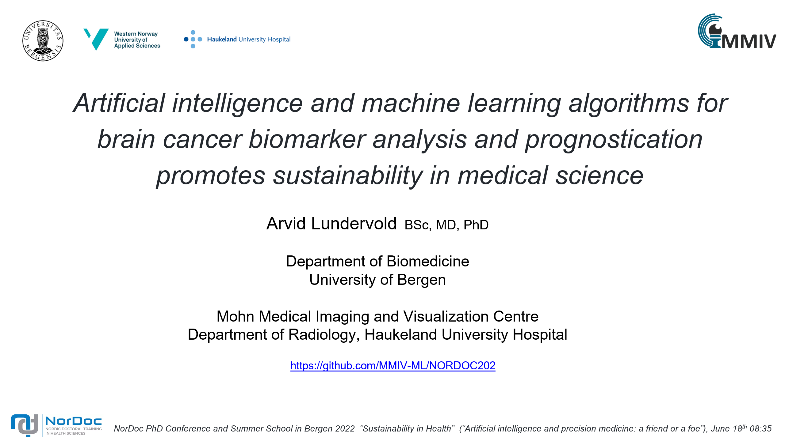

# NorDoc2022: Artificial intelligence and deep learning for precision imaging

> Part of the NorDoc PhD Conference on _[Sustainability in Health](https://www.uib.no/en/med/146139/nordoc-phd-summit-and-summer-school-bergen-2022)_, June 17&ndash;18, 2022. 

This short presentation and accompanying workshop take you on a guided tour of parts of the landscape of deep learning in the context of medical imaging. 

## Slides

Here you'll find PDF versions of the lecture slides.

### Slides from plenary presentation

Slides from the plenary presentation _Artificial intelligence and machine learning algorithms for brain cancer biomarker analysis and prognostication promotes sustainability in medical science_ by Arvid Lundervold.

### Slides from the workshop

The parts of the workshop connected to the slides linked below provide (i) an introduction to deep learning (connected to notebook `1.0-asl-segmentation-brain_tumor_segmentation.ipynb` linked below) and (ii) some perspectives about how to approach deep learning as a practical tool in any concrete application domain. 

## Notebooks

The hands-on part of the notebook is based on the first two notebooks linked below. The notebooks marked as "extra" will be mentioned as possible self-study material but will not be covered in any detail. 

| Notebook    |      1-Click Notebook      |
|:----------|------|
|  [1.0-asl-segmentation-brain_tumor_segmentation.ipynb](https://nbviewer.org/github/MMIV-ML/NORDOC2022/blob/master/nbs/1.0-asl-segmentation-brain_tumor_segmentation.ipynb)  | 
|  [2.0-asl-brain_tumor_analysis_radiomics.ipynb](https://nbviewer.org/github/MMIV-ML/NORDOC2022/blob/master/nbs/2.0-asl-brain_tumor_analysis_radiomics.ipynb)  | 
|  [extra-3.0-asl-nnets_building_blocks.ipynb](https://nbviewer.org/github/MMIV-ML/NORDOC2022/blob/master/nbs/extra-3.0-asl-nnets_building_blocks.ipynb)  | 
|  [extra-4.0-asl-tumor_grading.ipynb](https://nbviewer.org/github/MMIV-ML/NORDOC2022/blob/master/nbs/extra-4.0-asl-tumor_grading.ipynb)  | 

## Extra material

Some of the above notebook material has been used in other courses we've held previously. If you're interested, you may consider having a look at the recordings of these lectures.
- A version of the notebook `1.0-asl-segmentation-brain_tumor_segmentation.ipynb` was also presented here: https://youtu.be/cwjs4szpy3M?t=4817 
- A notebook similar to `extra-3.0-asl-nnets_building_blocks.ipynb` was presented here: https://www.youtube.com/watch?v=j0rwEPIpO-Y
- A notebook similar to `extra-4.0-asl-tumor_grading.ipynb` was presented here: https://youtu.be/0h7cy8kOFMA?t=3204. 

You'll find additional notebooks and resources for practical deep learning in biomedicine and biotech in the course repository for our course [HVL-MMIV-DLN-AI-2022](https://github.com/MMIV-ML/HVL-MMIV-DLN-AI-2022/tree/master/1-deep_learning).

